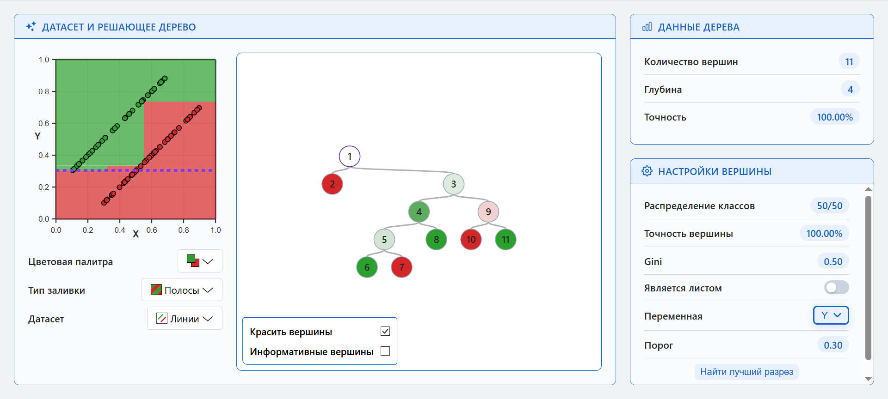

# DecisionTrees

<figure>
  
  <figcaption style="text-align: center">Приложение для визуализации и взаимодействия с решающим деревом</figcaption>
</figure>

## Возможности

Проект доступен по ссылке: https://sosnovgennadiy2006.github.io/DecisionTrees/.

Приложение позволяет:
1. Генерировать или создавать самому датасет точек на единичном квадрате;
2. Делить вершину дерева вручную двигая линию порога мышкой или искать наилучший разрез кнопкой;
3. Визуализировать интерактивное решающее дерево с хроматической раскраской в зависимости от чистоты вершины;
4. Автоматически считать показатели вершины.

Добавлены горячие клавиши:
1. Кнопка Enter для произвольного деления вершины;
2. Кнопка L для наилучшего деления в соответствии с критерием Джини;
3. Стрелочки LeftArrow, UpArrow и RightArrow для передвижении по дереву.

## Реализация

Проект написан на чистом HTML/CSS/JS и может работать полностью локально без интернета.

Реализованы следующие классы:
- `ColorMixer` - класс для смешивания цветов ([colors.js](js/colors.js));
- 4 класса для собственных селектов, находящиеся в файле [customSelects.js](js/customSelects.js);
- `Rect` - структура прямоугольника ([rect.js](js/rect.js));
- `DataElem` - структура точки датасета ([dataset.js](js/dataset.js));
- `DatasetGenerator` - класс для генерации разных датасетов ([dataset.js](js/dataset.js));
- `Separator` - класс прямой, разделяющей двух сыновей вершины ([separator.js](js/separator.js));
- `DatasetViewer` - класс для визуализации датасета с помощью послойной генерации svg-кода элементов (осей, точек, прямоугольников и линий) ([datasetViewer.js](js/datasetViewer.js));
- `Settings` - класс для отображения настроек (параметров) выбранной вершины ([settings.js](js/settings.js));
- `TreeNode` - класс бинарного дерева ([treeNode.js](js/treeNode.js));
- `BinaryTree` - класс отображающий дерево решений с интерактивными вершинами ([tree.js](js/tree.js)).

Посылка сообщений между классами реализована с помощью следующих js событий:
- `nodeThresholdChanged` - событие изменения порога в настройках вершины, вызывает перерисовку дерева.
- `nodeLeafPropertyUpdated` - событие изменения типа вершины в настройках, вызывает перерисовку дерева и добавление передвигаемой прямой на график датасета;
- `nodeVariableChanged` - изменения переменной порога вершины в настройках;
- `svgGenerated` - вспомогательное событие, вызываемое при генерации дерева. Нужно для обновления размеров дерева.